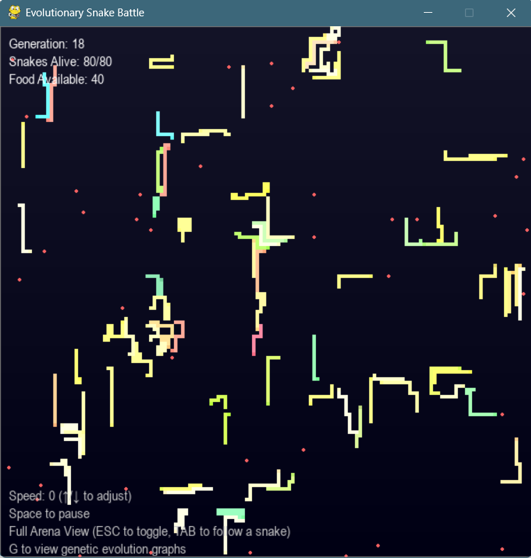
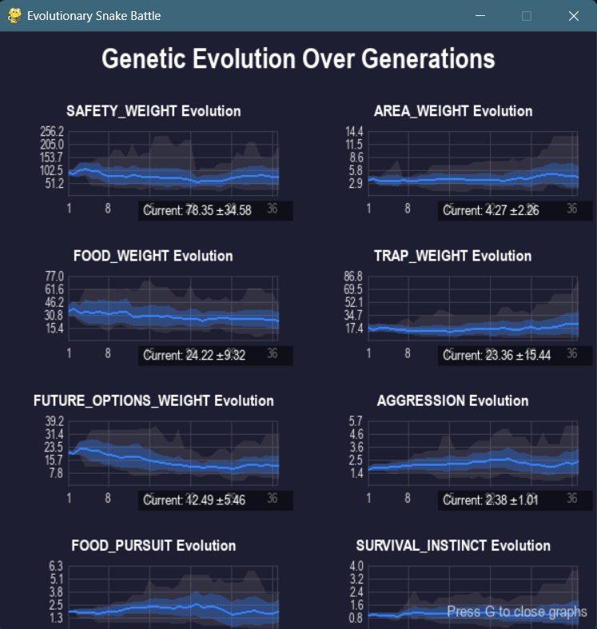

# Evolutionary Snake Battle

Watch snakes evolve in real-time. They fight, eat, reproduce, and pass on genetic traits that affect their behavior and appearance.

<table>
  <tr>
    <td></td>
    <td></td>
  </tr>
</table>

## What is this?

Snake game is a classic test of an LLM's programming ability, so I decided to try something a little more challenging. I built a game where the snakes moved based on an algorithm, and the algorithm's weights towards agression, self preservation, hunger, etc evolved as the snake split after eating enough. This led to very interesting emerant behavior including trap setting, feeding frenzies, solitary survivors, etc.

Each snake has 8 genes that control everything from aggression to survival instinct. Their color directly reflects their genetics (red = food-driven, green = aggressive, blue = cautious). When they reproduce at length 20, they split in two and pass on mutated genes. Press `G` to see real-time graphs of how the population's genes change over generations.

## Quick Start

```bash
pip install pygame numpy
python snake_evolution.py
```

## Controls

- `Space` - Pause
- `↑/↓` - Speed up/down
- `Tab` - Follow different snake
- `Esc` - Zoom out to see whole arena
- `G` - Evolution graphs

## The Magic

After ~50 generations, you'll see distinct behavioral patterns emerge. I've seen populations develop:
- Hyper-aggressive red snakes that are in continuous feeding frenzies
- Blue snakes that avoid all conflict and just eat scraps
- Balanced green-blue snakes that opportunistically switch strategies

Dead snakes become food. The arena self-regulates. It's fun to leave on overnight and see what you wake up to.

## Technical Details

- 150x150 world grid with viewport camera system
- Flood-fill pathfinding for trap detection
- Real-time genetic statistics tracking
- ~20% mutation rate with ±40% variance per gene

It's a fun example of complex behaviors emerging from simple rules.